---
# Front matter
lang: ru-RU
title: "Отчет по лабораторной работе №10"
subtitle: "Дисциплина: операционные системы"
author: "Сергеев Тимофей Сергеевич"

# Formatting
toc-title: "Содержание"
toc: true # Table of contents
toc_depth: 2
lof: true # List of figures
lot: true # List of tables
fontsize: 12pt
linestretch: 1.5
papersize: a4paper
documentclass: scrreprt
polyglossia-lang: russian
polyglossia-otherlangs: english
mainfont: PT Serif
romanfont: PT Serif
sansfont: PT Sans
monofont: PT Mono
mainfontoptions: Ligatures=TeX
romanfontoptions: Ligatures=TeX
sansfontoptions: Ligatures=TeX,Scale=MatchLowercase
monofontoptions: Scale=MatchLowercase
indent: true
pdf-engine: lualatex
header-includes:
  - \linepenalty=10 # the penalty added to the badness of each line within a paragraph (no associated penalty node) Increasing the value makes tex try to have fewer lines in the paragraph.
  - \interlinepenalty=0 # value of the penalty (node) added after each line of a paragraph.
  - \hyphenpenalty=50 # the penalty for line breaking at an automatically inserted hyphen
  - \exhyphenpenalty=50 # the penalty for line breaking at an explicit hyphen
  - \binoppenalty=700 # the penalty for breaking a line at a binary operator
  - \relpenalty=500 # the penalty for breaking a line at a relation
  - \clubpenalty=150 # extra penalty for breaking after first line of a paragraph
  - \widowpenalty=150 # extra penalty for breaking before last line of a paragraph
  - \displaywidowpenalty=50 # extra penalty for breaking before last line before a display math
  - \brokenpenalty=100 # extra penalty for page breaking after a hyphenated line
  - \predisplaypenalty=10000 # penalty for breaking before a display
  - \postdisplaypenalty=0 # penalty for breaking after a display
  - \floatingpenalty = 20000 # penalty for splitting an insertion (can only be split footnote in standard LaTeX)
  - \raggedbottom # or \flushbottom
  - \usepackage{float} # keep figures where there are in the text
  - \floatplacement{figure}{H} # keep figures where there are in the text
---

# Цель работы

Познакомиться с операционной системой *Linux*. Получить практические навыки работы с редактором *Emacs*.

# Выполнение лабораторной работы
* *Emacs* – текстовый редактор для программирования и обработки текстов. Является одним из стандартных текстовых редакторов в *Linux* и других *UNIX*-системах, также доступны клоны и версии практически для типов компьютеров и операционных систем.

* **Задание 1. Основные команды *emacs***

1. Открыть emacs.
   
 *Рисунок 1:*

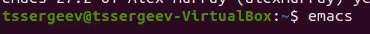 

*Рисунок 2:*

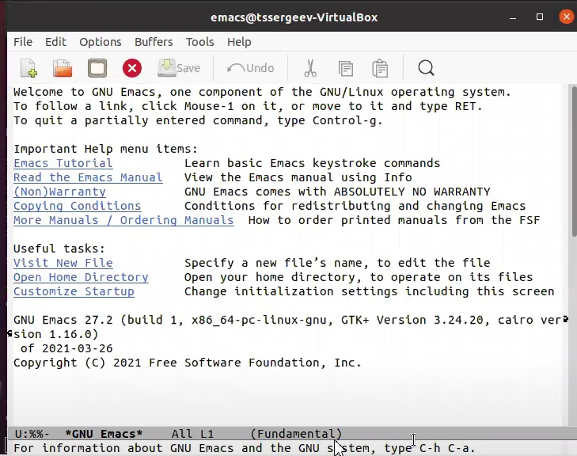 

2. Создать файл lab07.sh с помощью комбинации *Ctrl-x Ctrl-f (C-x C-f)*.

*Рисунок 3:*

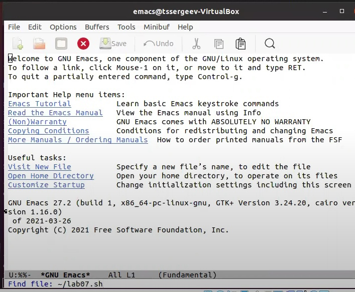 

3. Наберите текст:
>     #!/bin/bash
>     HELL=Hello
>     function hello 
>     {
>       LOCAL HELLO=World
>       echo $HELLO
>     }
>     echo $HELLO
>     hello

*Рисунок 4:*

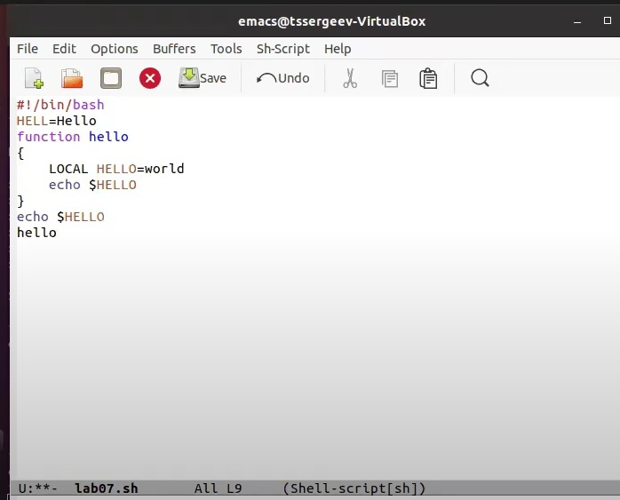 

4. Сохранить файл с помощью комбинации *Ctrl-x Ctrl-s (C-x C-s)*.

*Рисунок 5:*

 

5. Проделать с текстом стандартные процедуры редактирования, каждое действие
должно осуществляться комбинацией клавиш.

5.1. Вырезать одной командой целую строку *(С-k)*.

*Рисунок 6:*

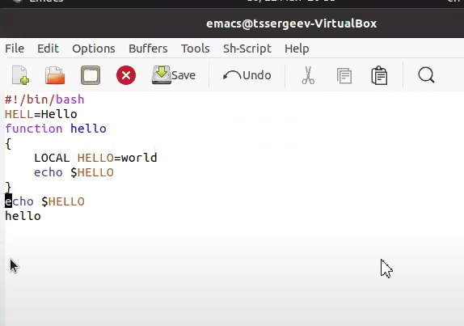

*Рисунок 7:*

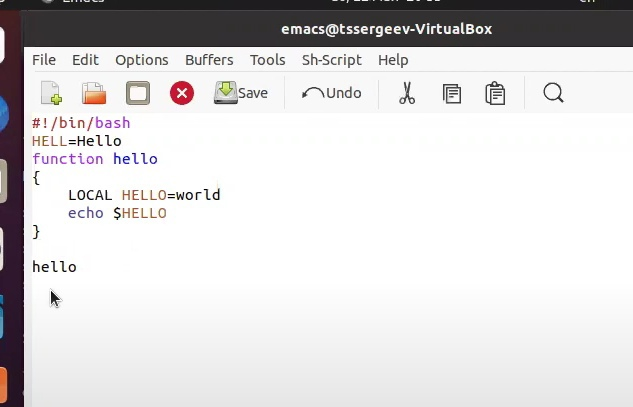

5.2. Вставить эту строку в конец файла *(C-y)*.

*Рисунок 8:*

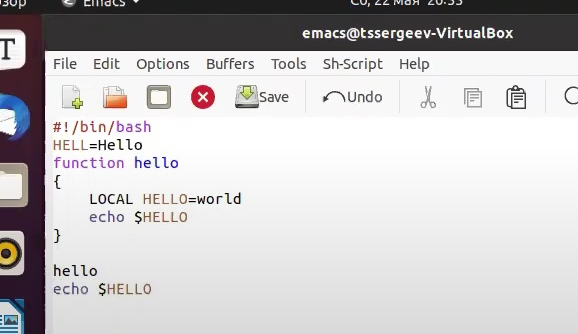

5.3. Выделить область текста *(C-space)*.

*Рисунок 9:*

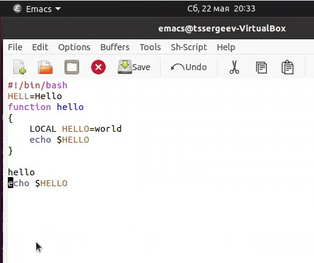

5.4. Скопировать область в буфер обмена *(M-w)*.

*Рисунок 10:*

5.5. Вставить область в конец файла.

*Рисунок 11:*

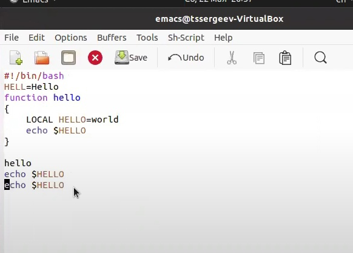

5.6. Вновь выделить эту область и на этот раз вырезать её *(C-w)*.

*Рисунок 12:*

5.7. Отмените последнее действие *(C-/)*.

*Рисунок 13:*

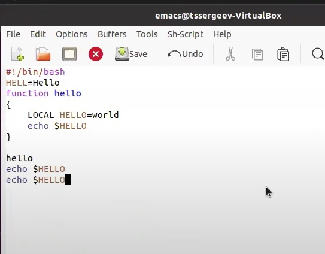

6. Научитесь использовать команды по перемещению курсора.

6.1. Переместите курсор в начало строки *(C-a)*.

*Рисунок 14:*

6.2. Переместите курсор в конец строки *(C-e)*.

*Рисунок 15:*

6.3. Переместите курсор в начало буфера *(M-<)*.

*Рисунок 16:*

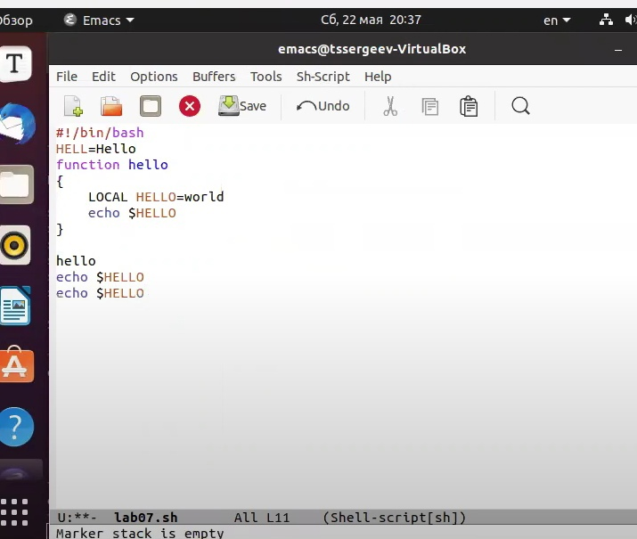

6.4. Переместите курсор в конец буфера *(M->)*.

*Рисунок 17:*

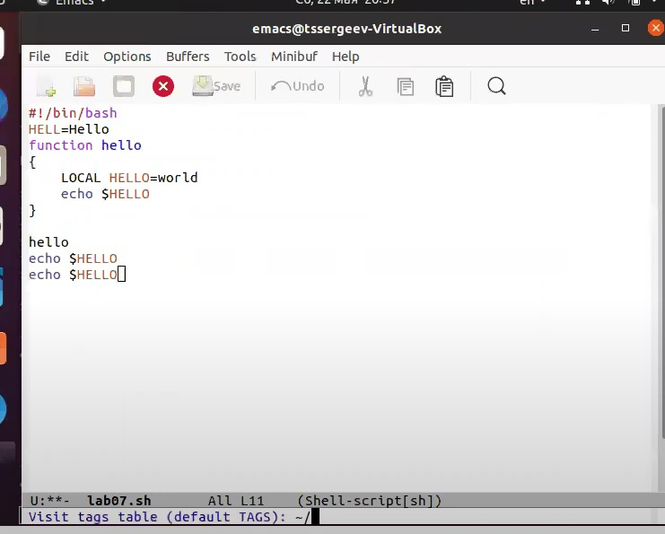

7. Управление буферами.

7.1. Вывести список активных буферов на экран *(C-x C-b)*.

*Рисунок 18:*

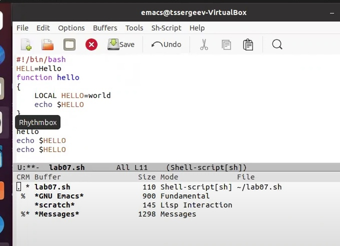

7.2. Переместитесь во вновь открытое окно *(C-x)* o со списком открытых буфеhов и переключитесь на другой буфер.

*Рисунок 19:*

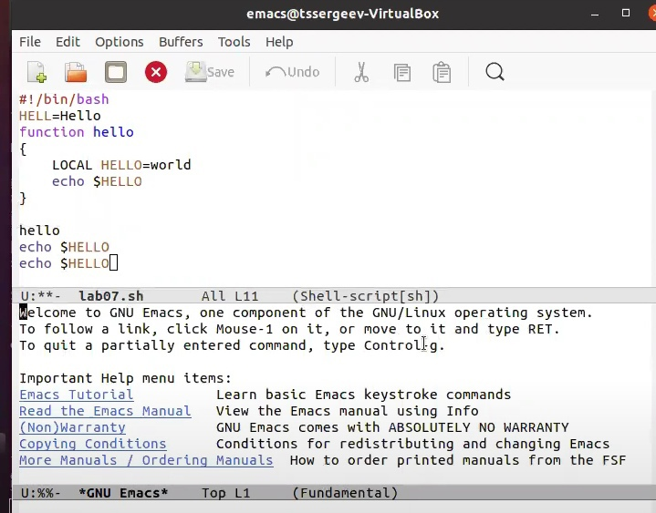

7.3. Закройте это окно *(C-x 0)*.

*Рисунок 20:*

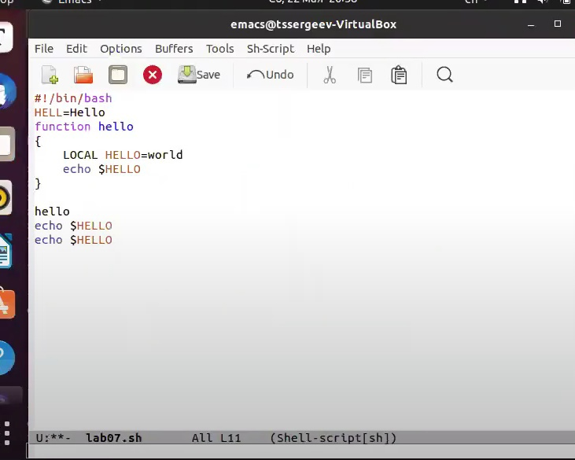

7.4. Теперь вновь переключайтесь между буферами, но уже без вывода их списка
на экран *(C-x b)*.

*Рисунок 21:*

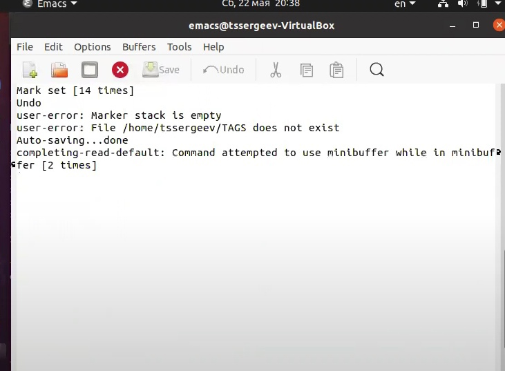

8. Управление окнами.

8.1. Поделите фрейм на 4 части: разделите фрейм на два окна по вертикали
*(C-x 3), а затем каждое из этих окон на две части по горизонтали *(C-x 2)*

*Рисунок 22:*

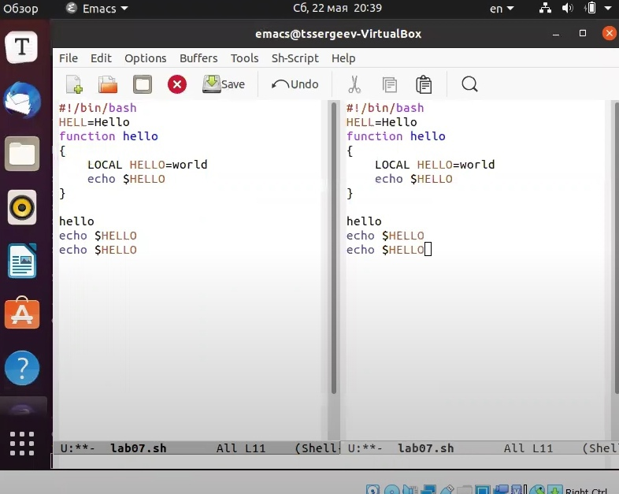

*Рисунок 23:*

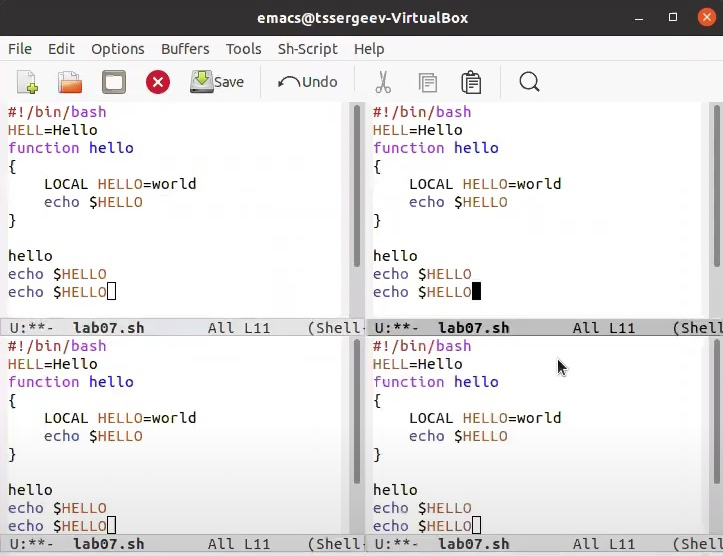

8.2. В каждом из четырёх созданных окон откройте новый буфер (файл) и введите несколько строк текста (Ввожу строку в первом строке, она отображается во всех).

*Рисунок 24:*

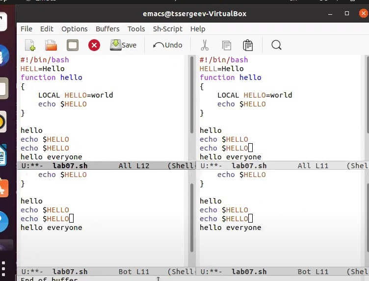

9. Режим поиска

9.1. Переключитесь в режим поиска *(C-s)* и найдите несколько слов, присутству-
ющих в тексте.

*Рисунок 25:*

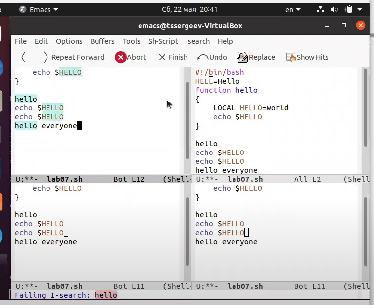

*Рисунок 26:*

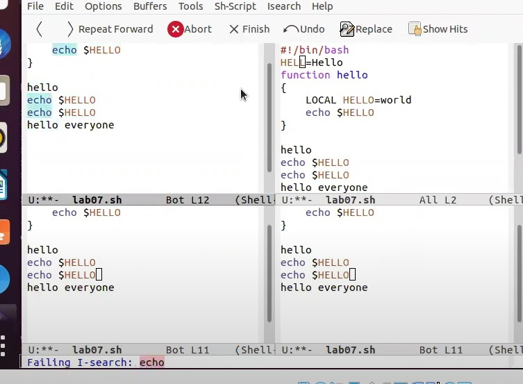

9.2. Переключайтесь между результатами поиска, нажимая *C-s*.

*Рисунок 27:*

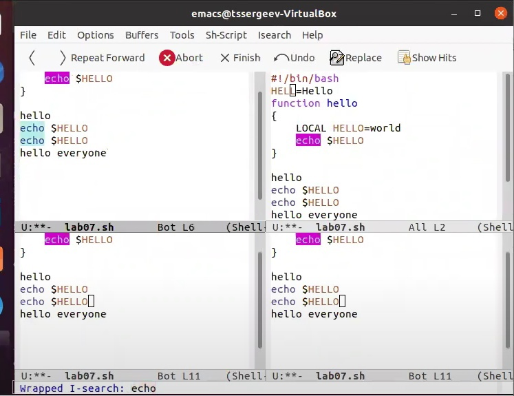

9.3. Выйдите из режима поиска, нажав *C-g*.

9.4. Перейдите в режим поиска и замены *(M-%)*, введите текст, который следует
найти и заменить, нажмите Enter , затем введите текст для замены. После то-
го как будут подсвечены результаты поиска, нажмите *!* для подтверждения
замены.

*Рисунок 28:*

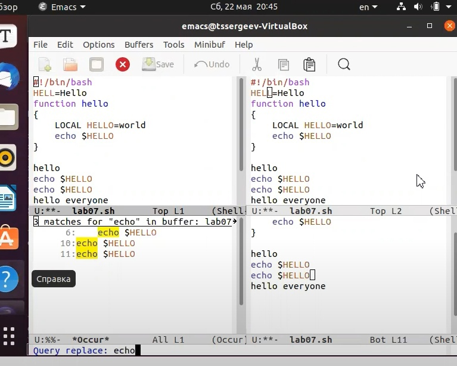

*Рисунок 29:*

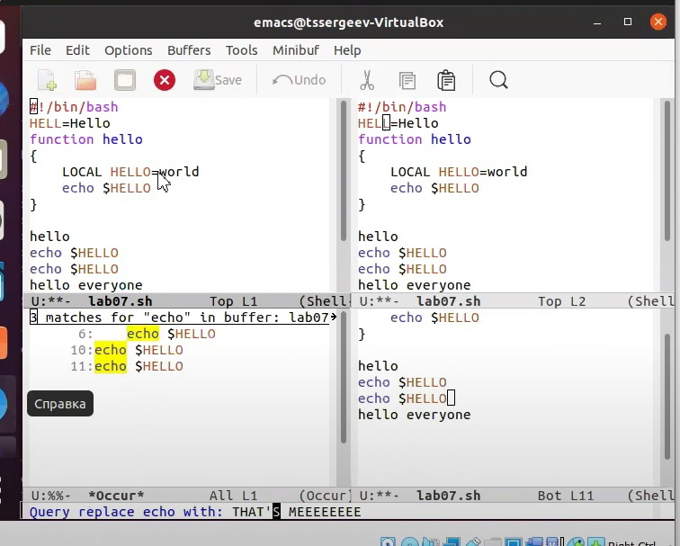

*Рисунок 30:*

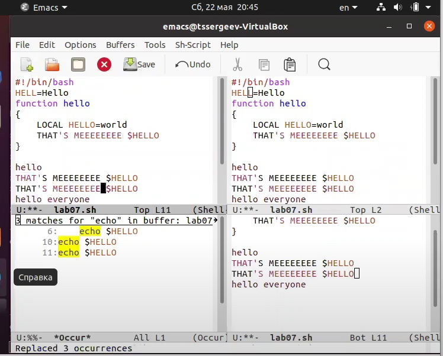

9.5. Испробуйте другой режим поиска, нажав *M-s o*. Объясните, чем он отличается от обычного режима?

Главное отличие в том, что результат отображается не в изначальном тексте, а выводится списком

*Рисунок 31:*

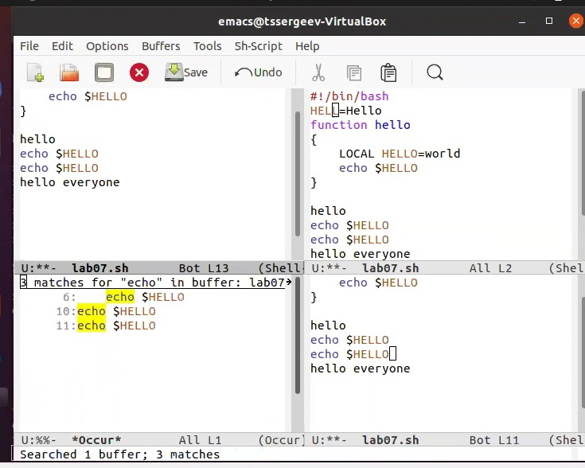

# Контрольные вопросы 

1. Emacs представляет собой мощный экранный редактор текста с массой возможностей. Его можно считать средой программирования с большими возможностями редактирования текста, т.к. Emacs предлагает массу встроенных функций по компиляции и поиску ошибок в коде.
2. Работа через консоль.
3. Файл и консоль, через которые ведется работа
4. В теории, да, но вряд ли.
5. Messages и интсрукция.
6. Ctrl+c, ctrl+shift+\
7. C помощью команды (C-x 3)
8. В одном из представленных выше в списке
9. Стирает, но можно переназначить
10. Emacs, он более интуитивный.

# Выводы

В ходе выполнения поставленных задач я продолжил знакомство с операционной системой *Linux*, а именно получил практические навыки работы с редактором *Emacs*.

# Библиография
* https://www.emacswiki.org
* https://ru.wikipedia.org/wiki/Emacs
* https://www.opennet.ru/docs/RUS/emacs_begin/
* https://www.unix-lab.org/posts/emacs/
